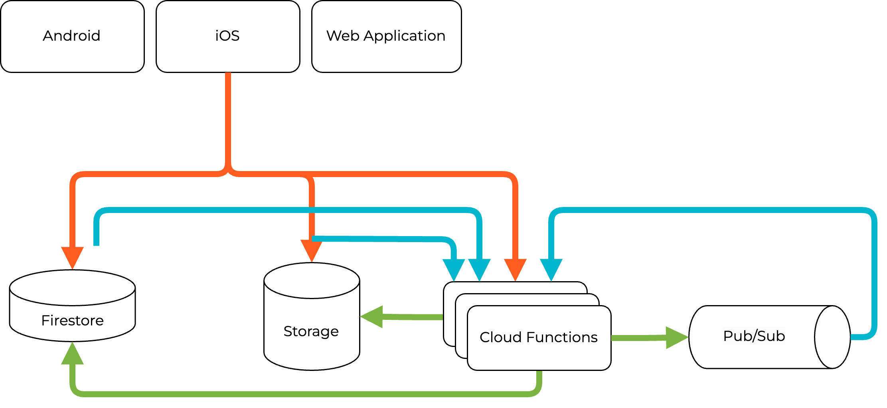
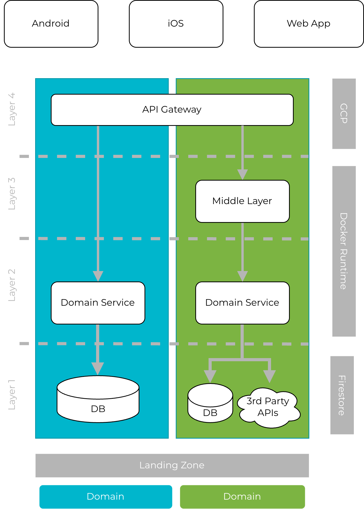
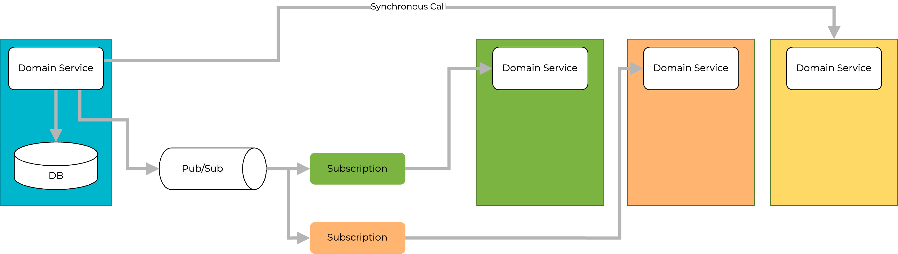

<style>
	* {
		font-size: 28px;
	}

	section {
		color: rgb(88, 103, 120);
		background-color: rgb(245,246,248);
		font-family: 'Montserrat', sans-serif;
	}

	h1,h2 {
		color: rgb(255, 92, 32);
		font-family: 'Archive', sans-serif;
	}

    img[alt~="center"] {
      display: block;
      margin: 0 auto;
    }

</style>

# Craftnote


An Overview of our Product and Tech-Stack

*Tobias Hornberger - Staff Engineer*

---

# History of Craftnote
* Created as project-based group chat (think Whatsapp groups with additional construction-specific data)
* Investors: Fischer, GC Gruppe (later)
* More features, more people
* Aceve

---

# Features
* Projects
  * Chat
  * Files
  * Tasks
* Time & Attendance
* Planning Board
* Dashboard
* Vehicle
* Public API


---

# Demo Time


---

# Initial Tech Stack
* Firebase/Google Cloud:
  * Cloud Functions (Node.js/TypeScript)
  * Firestore NoSQL database
  * Cloud Storage
  * Pub/Sub
* Frontends:
  * Angular Web App
  * Native iOS & Android Apps

---

# Firestore
* Offline Support
* Live Updates
* Direct Access from Frontends possible

---

# Firestore Example

```
import { collection, getDocs } from "firebase/firestore"; 

const querySnapshot = await getDocs(collection(db, "users"));
querySnapshot.forEach((doc) => {
  console.log(`${doc.id} => ${doc.data()}`);
});
```
---

# Old Architecture Overview


---

# Problems
* Firestore
  * No control over data
  * Migrations painful
  * Caching hard
  * Expensive
* Heavy-weight clients
* Coupling
  * Difficult to scale team

---

# Current Tech Stack Overview


---

# Event-Driven Architecture



---

# Furthermore
* API Gateway
* Redis: cache, etc
* Websockets for realtime updates
* Offline support in mobile clients


---


# Thank you!
